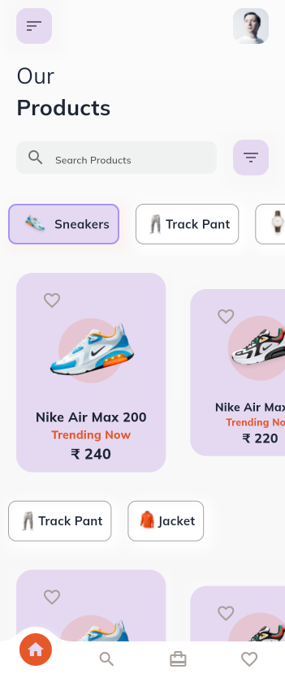
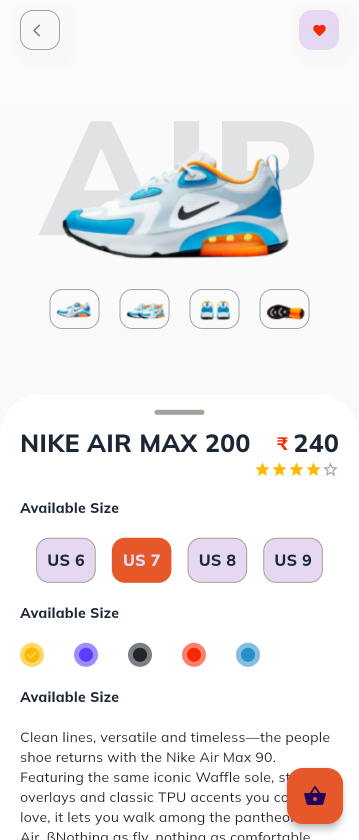
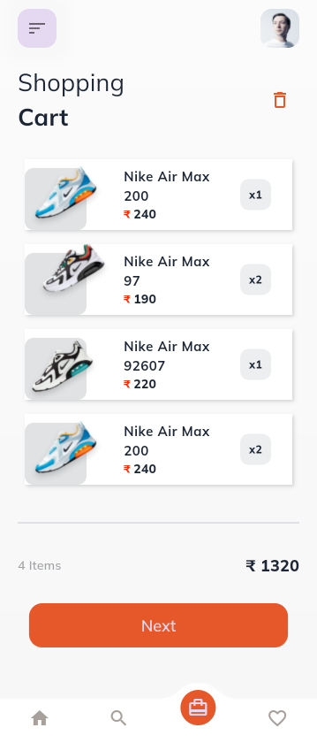

# E-commerce-Flutter  

An elegant and scalable E-commerce application built with Flutter. This app provides a seamless shopping experience with intuitive navigation, beautiful UI, and robust functionality.  

## Features  
- **User Authentication**: Sign in, sign up, and manage user profiles.  
- **Product Listing**: View products with dynamic filtering and categorization.  
- **Shopping Cart**: Add to cart, view cart items, and manage quantities.  
- **Wishlist**: Save favorite items for later purchases.  
- **Payment Integration**: Streamlined payment process (e.g., Razorpay, Stripe).  
- **Order History**: Track past orders with detailed information.  

## Screenshots  

| Home Screen | Product Details | Cart Screen |  
|-------------|------------------|-------------|  
|  |  |  |  

## Tech Stack  
- **Framework**: Flutter  
- **State Management**: Provider / BLoC (your choice)  
- **Backend**: Firebase / Node.js (mention as per your use)  
- **Database**: Firestore / MongoDB / MySQL (mention your database)  
- **Payment Gateway**: Razorpay / Stripe  

## How to Run  
1. Clone the repository:  
   ```bash  
   git clone https://github.com/yourusername/E-commerce-Flutter.git  
